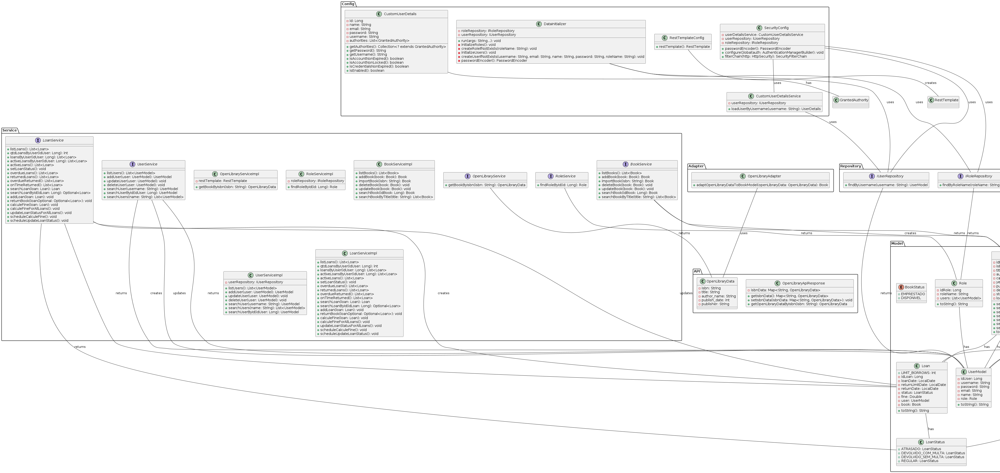

# Biblioteca Ouro Branco

Este Projeto de um Sistema de Gerenciamento de Biblioteca que utiliza como linguagem principal Spring Boot Java com Thymeleaf, o banco de dados PostgreSQL e alguns dos padrões de projeto GRASP e GOF. Sua finalidade é permitir ao usuário principal (admin) buscar, emprestar e devolver livros, bem como, gerenciar o catálogo de livros da biblioteca e os usuários, além disso, outros usuários cadastrados (clientes) poderão procurar por livros, verificar os livros que pegaram emprestado e se estão devendo a devolução de algum livro.

# Site
Você pode testar o Sistema online no seguinte link: https://bibliotecaob.onrender.com

## Funcionalidades:

### Admin:
* Adicionar, editar e exluir usuários.
* Adicionar, atualizar e excluir livros no catálogo da biblioteca.
* Registrar o emprestimo de livros para usuários.
* Registrar devoluções de livros.
* Listar empréstimos e disponibilidade de livros.
* Listar devoluções realizadas com multa e sem multa.

### User:
* Visualizar emprestimos, bem como o status de cada um.
* Visualizar o catalogo de livros afim de verificar a disponibilidade de algum.

## Padrões GRASP
Os Padrões GRASP (General Responsibility Assignment Software Patterns) fornecem uma abordagem sistemática para a atribuição de responsabilidades às classes do projeto, com isso, neste sistema serão empregados os cinco padrões GRASP básicos, sendo eles:

1. Information Expert (Especialista): responsabilidade deve ser atribuída à classe que possui as informações necessárias para cumprir essa responsabilidade.

2. Creator (Criador): Uma classe deve ser responsável por criar instâncias de outras classes quando existe uma relação de composição entre elas.

3. Controller (Controlador): Uma classe (ou objeto) deve ser designada para gerenciar e coordenar as interações entre diferentes partes do sistema.

4. Low Coupling (Baixo Acoplamento): As classes devem ser projetadas de forma a minimizar as dependências entre elas, reduzindo assim o acoplamento.

5. High Cohesion (Alta Coesão): As responsabilidades de uma classe devem estar relacionadas de forma coesa e não dispersas em várias partes do sistema.

## Padrões GoF

Os Padrões GoF (Gang of Four) são um conjunto de 23 padrões de projeto comuns que fornecem soluções para problemas de design de software,divididos em três categorias (Criação, Estrutura e Comportamento), com isso, os seguintes padrões, separados por categoria, serão utilizados no projeto:

1. Padrões de Criação: Lidam com a criação de objetos.
   * Singleton: Garante que uma classe tenha apenas uma instância e fornece um ponto global de acesso a essa instância.

2. Padrões de Estrutura: Tratam da composição de objetos para formar estruturas maiores.
   * Adapter: Permite que você faça com que interfaces incompatíveis funcionem juntas. 

## Outros Padrões

Aqui estão listados outros padrões de projetos que são utilizados em aplicações Spring Boot.

1. MVC (Model-View-Controller):
   * O padrão MVC é um padrão arquitetural que separa uma aplicação em três componentes principais: Model (modelo), View (visualização) e Controller (controlador). O objetivo é separar as responsabilidades e melhorar a modularidade e a manutenção do código.

## API Open Library
A API Open Library oferece uma vasta quantidade de informações sobre livros, incluindo detalhes como título, autor, capa, resumo e muito mais. E será utilizada no projeto para importar informações de livros ao cadastrar um livro.

## Diagrama de Classes

